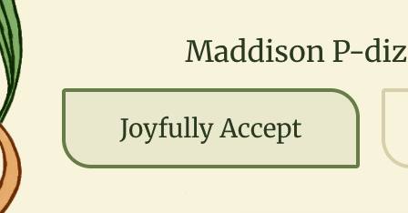

All:

- Chapter/page headings should use the red colour and be increased in size by 25%

- Update submit buttons to be more art nouvea styled. Perhaps an elongated octogon?

- All text viewing boxes to be squares with rounded edges on all corners. No pointy corners for 2 and rounded for 2. This is found on the RSVP summary page. It's basically this shape we don't want anywhere..

IMportant details:

- The text dividers on pixel 9a have been moved slightly right making the text look off-centre

- Doors open changed to "Arrival between 12:30 and 13:00"

RSVP:

- Drink selection
  - Change mojito to margarita
  - Make soft drinks singular
  - Change wording to "Vote for your favourites"
  - Add
    - 0% Alcohol to the options

- I should be able to paste a 4 digit code in and it just work. Currently it enteres the first digit then moves to the 2nd box.

The Venue

- The example map link doesn't work right.. prompt to give you the right one..

Food and Drinks

- For the food items
  - Drop the tags
  - For the pizza one call out it's for in the evening
  -

- For the drink pii chart
  - Can the pii chart be spinnable..
  - One of the segments show the detail of the drink and vote percentage to the side of the pii chart.
  - The chart should spin like a game show chicka chicka sound and feeling.
